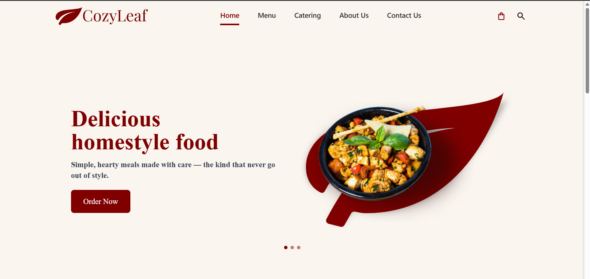
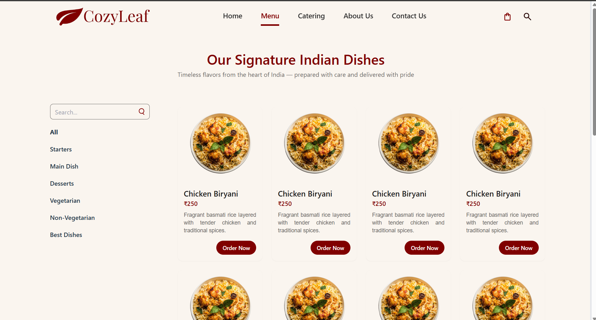
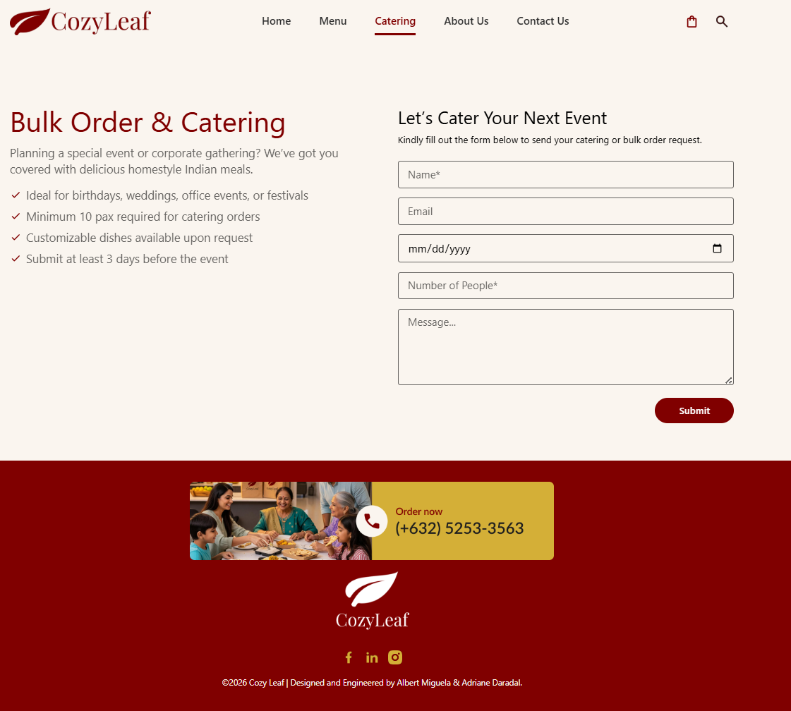
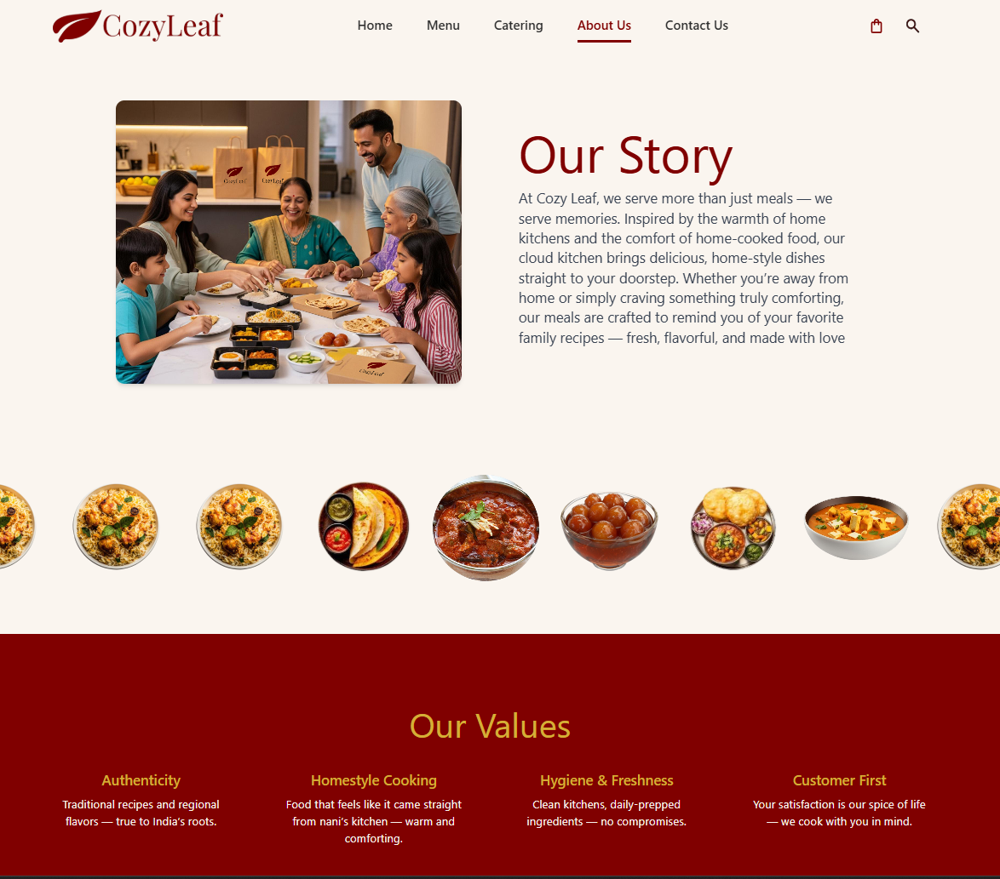
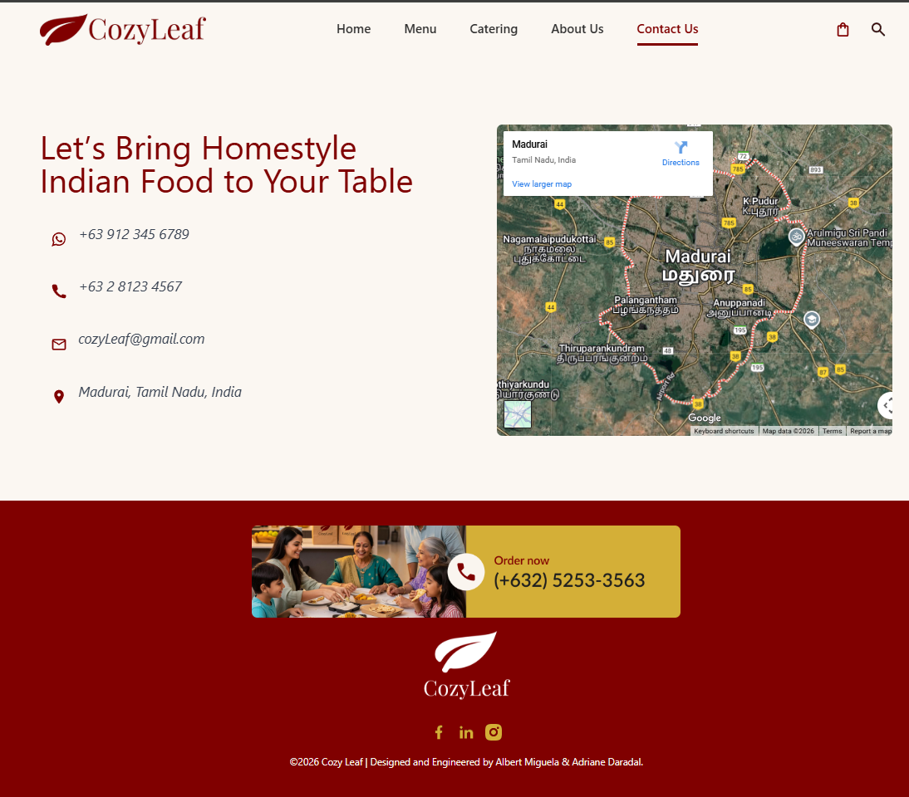

Cozy Leaf – Food Menu Website

A responsive food menu website for Cozy Leaf, developed using Vue 3, Vite, and Tailwind CSS.

Frontend Development: Albert M. Miguela

Figma Design Collaboration: Adriane Daradal

The project follows clean UI/UX standards, smooth navigation, and a mobile-first layout to deliver an optimal user experience across devices.

- Features

Vue 3 Composition API using <script setup>

Vite for fast development and optimized builds

Tailwind CSS for responsive, modern styling

Fixed header with scroll-based styling

Scroll progress indicator

Scroll-to-top button

Mobile-friendly navigation menu

Supports images for menu items, banners, and sections

- Screenshots

- Images are displayed directly from the repository using relative paths.

    
- Main Modules

Home

Menu

Catering

About Us

Contact Us

- Tech Stack Used

Vue 3

Vite

Tailwind CSS

Vue Router

Installation & Setup
1️ Clone the Repository
git clone https://github.com/your-username/cozy-leaf.git
2️ Navigate to the Project Folder
cd cozy-leaf
3️ Install Dependencies
npm install
4️ Run the Development Server
npm run dev

The application will be available at:

http://localhost:5173